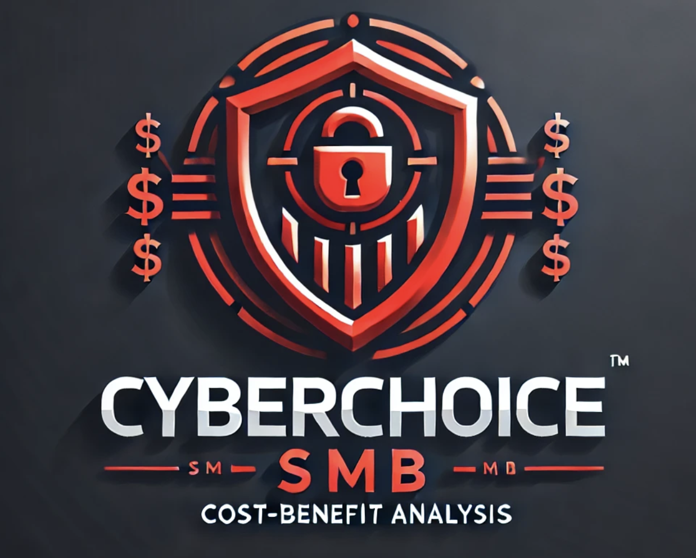

# CyberChoice SMB - Cybersecurity Cost Benefits Analysis for Small Businesses by VuduVations



CyberChoice SMB is an open-source Python-based tool designed to help small businesses evaluate the cost benefits of implementing cybersecurity measures. By assessing various assets, threats, and safeguards, CyberChoice SMB provides insights into the financial impact of different security strategies, helping businesses make informed decisions on whether to upgrade or update their cybersecurity infrastructure.

## Table of Contents

- [Features](#features)
- [Installation](#installation)
- [Usage](#usage)
- [Definitions](#definitions)
- [Example CSV Data](#example-csv-data)
- [Functions](#functions)
- [Contributing](#contributing)
- [License](#license)

## Features

- Calculate Annual Loss Expectancy (ALE) before and after implementing safeguards.
- Evaluate cost savings and net savings from implementing cybersecurity measures.
- Make informed decisions with the `Go` or `No Go` criterion.
- Visualize key metrics through informative plots.
- Interactive web interface for uploading data and visualizing results.

## Benefits for Small Businesses

- **Informed Decision-Making**: Assess the financial impact of potential cybersecurity upgrades and updates.
- **Cost-Effectiveness**: Determine the most cost-effective security measures to implement.
- **Risk Assessment**: Understand the potential risks and their implications for your business.
- **Resource Allocation**: Optimize resource allocation by identifying critical areas needing attention.

## Installation

1. Clone the repository:

   ```sh
   git clone https://github.com/your-username/cyberchoice-smb.git
   ```

2. Navigate to the project directory:

   ```sh
   cd cyberchoice-smb
   ```

3. Install the required dependencies:

   ```sh
   pip install pandas numpy plotly dash dash-bootstrap-components
   ```

## Usage

Prepare your CSV data with the necessary columns:

- `Asset ID/Name`
- `Type`
- `Application/Software Name`
- `Version`
- `Vendor`
- `Purchase Cost`
- `Development Cost`
- `Admin Cost`
- `Annual Maintenance Cost`
- `Criticality`
- `Data Sensitivity`
- `Threats`
- `Safeguard Measures`
- `Safeguard Cost`
- `EF`
- `Pre ARO`
- `Post ARO`
- `Pre SLE`
- `Post SLE`

1. Run the `app.py` script to start the web application:

  ```sh
   python app.py
  ```

2. Open a web browser and go to `http://127.0.0.1:8050` to interact with the application.

3. Upload your CSV file to see the CBA metrics and overall decisions.

## Definitions

`Safeguard Cost`: The total cost associated with implementing a specific safeguard measure to protect an asset from potential threats. This includes initial implementation costs and any ongoing expenses directly related to the safeguard.
Example: If a company installs a firewall to protect its network, the safeguard cost would include the purchase price of the firewall and any associated setup and maintenance fees.

The Exposure Factor uses the term 'asset' which can be confusing.  

In reality, the asset being referenced is the value of an entity (e.g., Hardware, Software, Data) that is at risk of loss or damage due to a specific threat.

`Hardware Assets:`

 - Example: Servers, computers, networking equipment (such as firewalls and routers), and storage devices.
 - Use Case: For a server, EF might measure the percentage of its value that could be lost in a data breach. For a firewall, EF might measure the percentage of its value that could be impacted if the firewall is compromised or fails.

So, how do you measure a hardware asset like a firewall? The exposure factor for a firewall might reflect the percentage of the firewall's value that could be lost if it is breached or fails to prevent an attack. 
For example, if a firewall costs $10,000 and a breach could result in 20% of its value being compromised (due to damage or replacement costs), the EF would be 0.2 (or 20%).

`Software Assets:`

 - Example: Applications, operating systems, and databases.
 - Use Case: For a customer relationship management (CRM) software, EF might measure the potential loss if customer data is exposed due to a vulnerability.

There are several examples of data breaches and the costs associated with audits, reporting, and fines. You could measure the EF for CRM that might reflect the potential loss if customer data 
is exposed due to a vulnerability. If the CRM software's value is estimated at $50,000 and a data breach could compromise 30% of this value (due to loss of business, fines, and remediation costs), the EF would be 0.3 (or 30%).

`Data Assets:`

Example: Customer data, intellectual property, financial records, and proprietary information.
Use Case: For customer data, EF might measure the potential loss in terms of monetary value and reputation if the data is stolen or corrupted.

The exposure factor for customer data might reflect the potential loss if the data is stolen or corrupted. If the data's value is estimated at $100,000 and a breach could compromise 50% of this value (due to legal costs, loss of customer trust, and mitigation expenses), the EF would be 0.5 (or 50%).

`EF (Exposure Factor):` A percentage that represents the potential loss a specific threat can cause to an asset. It quantifies the impact of a threat on the asset in the event of an occurrence.
Example: An exposure factor of 0.2 (or 20%) means that the threat could potentially cause a 20% loss in the asset's value.

`Pre ARO (Annualized Rate of Occurrence before safeguard):` The estimated frequency or rate at which a specific threat is expected to occur annually before any safeguards are implemented.
Example: If the Pre ARO for phishing attacks is 0.3, it means that phishing attacks are expected to occur three times per year before any protection measures are put in place.

`Post ARO (Annualized Rate of Occurrence after safeguard):` The estimated frequency or rate at which a specific threat is expected to occur annually after safeguards have been implemented.
Example: If the Post ARO for phishing attacks is reduced to 0.1 after implementing email filtering software, it means that the expected occurrence is now once per year.

`Pre SLE (Single Loss Expectancy before safeguard):` The expected monetary loss each time a specific threat occurs before any safeguards are implemented. It is calculated as the asset's value multiplied by the exposure factor (EF).
Example: If an asset worth $10,000 has an exposure factor of 0.2, the Pre SLE would be $10,000 * 0.2 = $2,000.

`Post SLE (Single Loss Expectancy after safeguard):` The expected monetary loss each time a specific threat occurs after safeguards have been implemented. It is calculated similarly to Pre SLE but reflects the reduced impact due to the safeguard.
Example: If the safeguard reduces the exposure factor to 0.1, then the Post SLE for the same $10,000 asset would be $10,000 * 0.1 = $1,000.

`ALE_Pre (Annual Loss Expectancy before safeguard):` The expected annual monetary loss due to a specific threat before any safeguards are implemented. It is calculated as Pre ARO multiplied by Pre SLE.
Example: If the Pre ARO is 0.3 and the Pre SLE is $2,000, the ALE_Pre would be 0.3 * $2,000 = $600.

`ALE_Post (Annual Loss Expectancy after safeguard):` The expected annual monetary loss due to a specific threat after safeguards have been implemented. It is calculated as Post ARO multiplied by Post SLE.
Example: If the Post ARO is 0.1 and the Post SLE is $1,000, the ALE_Post would be 0.1 * $1,000 = $100.

`ACS (Annual Cost of Safeguard):` The total annual cost associated with maintaining and operating a specific safeguard. It includes all recurring expenses related to the safeguard.
Example: If maintaining a firewall costs $500 annually and the associated antivirus software costs $200 annually, the ACS would be $500 + $200 = $700.

`Savings:` The amount of money saved annually by implementing a safeguard. It is calculated as the difference between ALE_Pre and ALE_Post.
Example: If the ALE_Pre is $600 and the ALE_Post is $100, the annual savings would be $600 - $100 = $500.

`Net Savings:` The actual financial benefit realized from implementing a safeguard, taking into account the cost of the safeguard. It is calculated as Savings minus ACS.
Example: If the annual savings are $500 and the ACS is $700, the Net Savings would be $500 - $700 = -$200 (a negative value indicating a net loss).

## Example CSV Data

Here is an example of the CSV data format:

```csv
Asset ID/Name,Type,Application/Software Name,Version,Vendor,Purchase Cost,Development Cost,Admin Cost,Annual Maintenance Cost,Criticality,Data Sensitivity,Threats,Safeguard Measures,Safeguard Cost,EF,Pre ARO,Post ARO,Pre SLE,Post SLE
CRM001,Software,Salesforce,2023,Salesforce,500,100,50,120,High,High,Data breach; Unauthorized access,Two-factor authentication; Regular software updates,200,0.2,0.1,0.05,100,50
...
```

## Functions

`(calculate_ale(pre_aro, post_aro, pre_sle, post_sle)`
Calculates the Annual Loss Expectancy (ALE) before and after implementing safeguards.

`(update_cba_metrics(df)`
Updates the DataFrame with calculated CBA metrics:

- ALE before and after safeguards
- Annual Cost Savings (ACS)
- Savings
- Net Savings
- Decision (Go or No Go)

`(plot_interactive_cba_metrics(df)`
Plots the CBA metrics using Plotly.

`parse_contents(contents, filename)`
Parses the uploaded CSV file and returns the figures for the plots.

## Contributing

Please fork the repository and submit a pull request for any enhancements or bug fixes.

## License

This project is licensed under the MIT License - see the [LICENSE](LICENSE) file for details.
